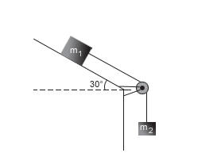

# Ilustracao-estatica
Trabalho de Mecânica para Engenharia da Computação 2022.1, professora Tatiana

O trabalho consiste na resolução de uma questão do livro no assunto de estática e criar um código que possa alterar as diversas variáveis mantendo a situação em repouso.

# Questão escolhida

 
  

# Interface do programa

 
  

